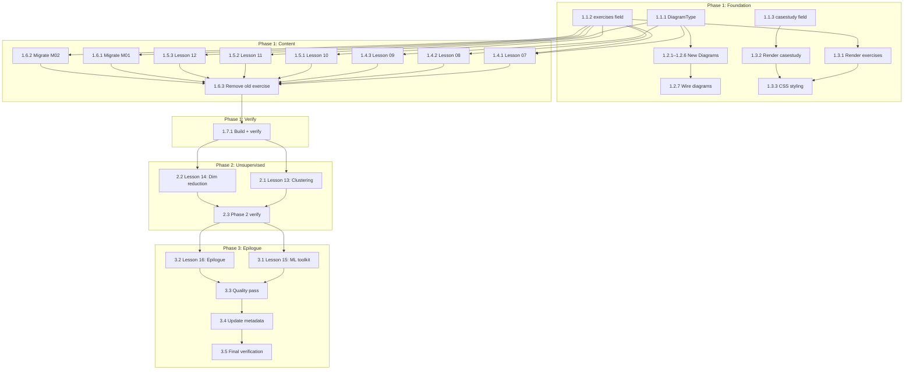

# Implementation Roadmap — ML Course Content Blueprint

> This is the execution plan for [ml_course_content_blueprint.md](file:///Users/visheshpanghal/Documents/making/research/ml_course_content_blueprint.md). Tasks are ordered by dependency chain.

---

## Current State Assessment

| Item | Status | Details |
|:---|:---|:---|
| **Modules with deep content** | ✅ Done | Module 01 (3 lessons), Module 02 (3 lessons) |
| **Modules needing expansion** | ✅ Done | Module 03 (3 lessons), Module 04 (3 lessons) |
| **Modules to create** | ❌ Not started | Module 05 (Unsupervised), Module 06 (ML Landscape) |
| **Type system** | ✅ Done | Restructured to support multi-tier exercises and case studies |
| **Diagram components** | ✅ Done | All 6 new diagram types implemented (cluster, reduction, flowchart, bias, confusion_matrix, drift) |
| **Lesson page UI** | ✅ Done | Renders multi-tier exercises and inline case studies |

### Files to touch

| File | Role |
|:---|:---|
| [course-data.ts](file:///Users/visheshpanghal/Documents/making/lib/course-data.ts) | Types + all lesson content |
| [diagrams.tsx](file:///Users/visheshpanghal/Documents/making/components/diagrams.tsx) | SVG diagram components |
| [page.tsx (lesson)](file:///Users/visheshpanghal/Documents/making/app/courses/%5BcourseSlug%5D/%5BlessonSlug%5D/page.tsx) | Lesson page renderer |
| [globals.css](file:///Users/visheshpanghal/Documents/making/app/globals.css) | Styling for new components |

---

## Phase 1: Foundation + Deepen Existing Content

> **Goal:** Restructure the type system, build new diagram components, update the lesson page UI, and expand Modules 03–04 to blueprint depth.

---

### Step 1.1 — Type System Restructure

- [x] **Task 1.1.1: Update `DiagramType` union**
  - **File:** [course-data.ts](file:///Users/visheshpanghal/Documents/making/lib/course-data.ts#L1)
  - **What:** Add 6 new diagram types: `cluster`, `reduction`, `flowchart`, `bias`, `confusion_matrix`, `drift`
  - **Complexity:** Low
  - **Dependencies:** None
  - **Accept when:** TypeScript compiles, no errors

- [x] **Task 1.1.2: Add `exercises` field to `Lesson` type**
  - **File:** [course-data.ts](file:///Users/visheshpanghal/Documents/making/lib/course-data.ts#L3-L20)
  - **What:** Add new `exercises: { conceptual, applied, critical }` field. Keep old `exercise` field temporarily for backward compatibility.
  - **Complexity:** Low
  - **Dependencies:** None
  - **Accept when:** Type compiles with both old and new fields

- [x] **Task 1.1.3: Add `casestudy` field to `Lesson` type**
  - **File:** [course-data.ts](file:///Users/visheshpanghal/Documents/making/lib/course-data.ts#L3-L20)
  - **What:** Add optional `casestudy?: { title: string; body: string[] }` field
  - **Complexity:** Low
  - **Dependencies:** None
  - **Accept when:** Type compiles

- [x] **Task 1.1.4: Update course metadata**
  - **File:** [course-data.ts](file:///Users/visheshpanghal/Documents/making/lib/course-data.ts#L41-L50)
  - **What:** Update `duration` to `"14–18 hours"`, update `description` and `promise` to reflect expanded scope
  - **Complexity:** Low
  - **Dependencies:** None

---

### Step 1.2 — New Diagram Components

- [x] **Task 1.2.1: Create `ClusterDiagram` component**
  - **File:** [diagrams.tsx](file:///Users/visheshpanghal/Documents/making/components/diagrams.tsx)
  - **What:** SVG showing 3 clusters of colored points with centroids. Show K-Means centroid positions.
  - **Complexity:** Medium
  - **Dependencies:** Task 1.1.1
  - **Accept when:** Renders correctly for `diagram="cluster"`

- [x] **Task 1.2.2: Create `ReductionDiagram` component**
  - **File:** [diagrams.tsx](file:///Users/visheshpanghal/Documents/making/components/diagrams.tsx)
  - **What:** SVG showing 3D points being projected onto a 2D plane (PCA intuition). Arrow showing projection direction.
  - **Complexity:** Medium
  - **Dependencies:** Task 1.1.1

- [x] **Task 1.2.3: Create `FlowchartDiagram` component**
  - **File:** [diagrams.tsx](file:///Users/visheshpanghal/Documents/making/components/diagrams.tsx)
  - **What:** SVG showing an algorithm selection decision tree: "Labeled data? → Yes → Regression/Classification, No → Clustering/PCA"
  - **Complexity:** Medium
  - **Dependencies:** Task 1.1.1

- [x] **Task 1.2.4: Create `BiasDiagram` component**
  - **File:** [diagrams.tsx](file:///Users/visheshpanghal/Documents/making/components/diagrams.tsx)
  - **What:** SVG showing the classic U-shaped bias-variance tradeoff curve. Training error decreasing, test error U-shaped. "Sweet spot" label.
  - **Complexity:** Medium
  - **Dependencies:** Task 1.1.1

- [x] **Task 1.2.5: Create `ConfusionMatrixDiagram` component**
  - **File:** [diagrams.tsx](file:///Users/visheshpanghal/Documents/making/components/diagrams.tsx)
  - **What:** SVG showing a 2×2 grid (TP, FP, FN, TN) with color coding.
  - **Complexity:** Low-Medium
  - **Dependencies:** Task 1.1.1

- [x] **Task 1.2.6: Create `DriftDiagram` component**
  - **File:** [diagrams.tsx](file:///Users/visheshpanghal/Documents/making/components/diagrams.tsx)
  - **What:** SVG showing two overlapping distribution curves (training vs. production) drifting apart over time.
  - **Complexity:** Medium
  - **Dependencies:** Task 1.1.1

- [x] **Task 1.2.7: Wire all new diagrams into `ConceptDiagram`**
  - **File:** [diagrams.tsx](file:///Users/visheshpanghal/Documents/making/components/diagrams.tsx#L3-L15)
  - **What:** Add rendering conditionals for all 6 new diagram types in the main `ConceptDiagram` component
  - **Complexity:** Low
  - **Dependencies:** Tasks 1.2.1–1.2.6

---

### Step 1.3 — Lesson Page UI Updates

- [x] **Task 1.3.1: Render multi-tier exercises**
  - **File:** [page.tsx (lesson)](file:///Users/visheshpanghal/Documents/making/app/courses/%5BcourseSlug%5D/%5BlessonSlug%5D/page.tsx#L39)
  - **What:** Replace single exercise block with 3-tier layout (Conceptual / Applied / Critical Thinking), each with its own prompt + hint `
` toggle. Fall back to old `exercise` field if `exercises` is absent.
  - **Complexity:** Medium
  - **Dependencies:** Task 1.1.2

- [x] **Task 1.3.2: Render case study section**
  - **File:** [page.tsx (lesson)](file:///Users/visheshpanghal/Documents/making/app/courses/%5BcourseSlug%5D/%5BlessonSlug%5D/page.tsx)
  - **What:** Add a "CASE STUDY" section after the main body sections (before Key Ideas) that renders `lesson.casestudy` if it exists. Distinct styling with a left border accent.
  - **Complexity:** Low-Medium
  - **Dependencies:** Task 1.1.3

- [x] **Task 1.3.3: Style new exercise and case study blocks**
  - **File:** [globals.css](file:///Users/visheshpanghal/Documents/making/app/globals.css)
  - **What:** Add CSS for `.exercise-tier`, `.exercise-tier-label`, `.case-study` sections with distinct visual treatment. Exercise tiers should have subtle color differentiation (conceptual=blue, applied=green, critical=amber).
  - **Complexity:** Medium
  - **Dependencies:** Tasks 1.3.1, 1.3.2

---

### Step 1.4 — Expand Module 03 Content (Generalisation & Evaluation)

> **Current state:** 3 lessons × ~2 sections × ~2 paragraphs = thin.
> **Target state:** 3 lessons × ~5 sections × ~3 paragraphs = deep.

- [x] **Task 1.4.1: Expand Lesson 07 — Overfitting and generalisation**
  - **File:** [course-data.ts](file:///Users/visheshpanghal/Documents/making/lib/course-data.ts#L336-L350)
  - **What:** Add 3 new sections: "The Bias-Variance Tradeoff" (4 paragraphs), "The double descent phenomenon" (2 paragraphs), "Practical strategies — learning curves" (3 paragraphs). Expand existing 2 sections to 3 paragraphs each. Update `diagram` to `"bias"`. Add multi-tier `exercises`. Add `casestudy` (Amazon resume screening). Update `duration` to `"55 min"`. Update `keyIdeas` to 5.
  - **Complexity:** High (content writing)
  - **Dependencies:** Tasks 1.1.1, 1.1.2, 1.1.3

- [x] **Task 1.4.2: Expand Lesson 08 — Splitting data correctly**
  - **File:** [course-data.ts](file:///Users/visheshpanghal/Documents/making/lib/course-data.ts#L351-L365)
  - **What:** Add 3 new sections: "K-Fold Cross-Validation" (3 paragraphs), "Time-series splits" (3 paragraphs), "Data leakage — the silent performance killer" (3 paragraphs). Expand existing sections. Add multi-tier `exercises`. Update `duration` to `"50 min"`. Update `keyIdeas` to 5.
  - **Complexity:** High
  - **Dependencies:** Tasks 1.1.2

- [x] **Task 1.4.3: Expand Lesson 09 — Metrics and thresholds**
  - **File:** [course-data.ts](file:///Users/visheshpanghal/Documents/making/lib/course-data.ts#L366-L380)
  - **What:** Add 4 new sections: "The full metrics zoo" (3 paragraphs), "Regression metrics" (3 paragraphs), "Business metrics vs. model metrics" (3 paragraphs), "A/B testing ML models" (2 paragraphs). Update `diagram` to `"confusion_matrix"`. Add multi-tier `exercises`. Update `duration` to `"60 min"`. Update `keyIdeas` to 5.
  - **Complexity:** High
  - **Dependencies:** Tasks 1.1.1, 1.1.2

---

### Step 1.5 — Expand Module 04 Content (Building Useful Systems)

- [x] **Task 1.5.1: Expand Lesson 10 — Feature engineering and pipelines**
  - **File:** [course-data.ts](file:///Users/visheshpanghal/Documents/making/lib/course-data.ts#L388-L402)
  - **What:** Add 4 new sections: "Encoding categorical variables" (3 paragraphs), "Feature scaling" (3 paragraphs), "Temporal and interaction features" (3 paragraphs), "Case study — Uber's Michelangelo" (2 paragraphs — as `casestudy` field). Expand existing sections. Add multi-tier `exercises`. Update `duration` to `"60 min"`. Update `keyIdeas` to 5.
  - **Complexity:** High
  - **Dependencies:** Tasks 1.1.2, 1.1.3

- [x] **Task 1.5.2: Expand Lesson 11 — Deployment and monitoring**
  - **File:** [course-data.ts](file:///Users/visheshpanghal/Documents/making/lib/course-data.ts#L403-L417)
  - **What:** Add 4 new sections: "The ML lifecycle" (3 paragraphs), "Shadow deployments and canary releases" (3 paragraphs), "Drift detection in practice" (3 paragraphs), "Case study — Knight Capital's $440M loss" (as `casestudy`). Update `diagram` to `"drift"`. Add multi-tier `exercises`. Update `duration` to `"65 min"`. Update `keyIdeas` to 5.
  - **Complexity:** High
  - **Dependencies:** Tasks 1.1.1, 1.1.2, 1.1.3

- [x] **Task 1.5.3: Expand Lesson 12 — Responsible ML project (capstone)**
  - **File:** [course-data.ts](file:///Users/visheshpanghal/Documents/making/lib/course-data.ts#L418-L434)
  - **What:** Add 5 new sections: "Sources of bias in ML" (3 paragraphs), "Fairness metrics and their tensions" (3 paragraphs), "The EU AI Act and regulatory landscape" (2 paragraphs), "Model cards and datasheets" (3 paragraphs), "Feedback loops and unintended consequences" (2 paragraphs). Add `casestudy` (COMPAS recidivism). Add multi-tier `exercises`. Update `duration` to `"90 min"`. Update `keyIdeas` to 5.
  - **Complexity:** High
  - **Dependencies:** Tasks 1.1.2, 1.1.3

---

### Step 1.6 — Migrate Modules 01–02 to New Type System

- [x] **Task 1.6.1: Add `exercises` and `casestudy` to Module 01 lessons**
  - **File:** [course-data.ts](file:///Users/visheshpanghal/Documents/making/lib/course-data.ts#L57-L196)
  - **What:** Add multi-tier `exercises` field and optional `casestudy` to all 3 lessons in Module 01 (which already have deep section content). Keep old `exercise` field until full migration.
  - **Complexity:** Medium
  - **Dependencies:** Tasks 1.1.2, 1.1.3

- [x] **Task 1.6.2: Add `exercises` and `casestudy` to Module 02 lessons**
  - **File:** [course-data.ts](file:///Users/visheshpanghal/Documents/making/lib/course-data.ts#L197-L329)
  - **What:** Same as above for Module 02's 3 lessons.
  - **Complexity:** Medium
  - **Dependencies:** Tasks 1.1.2, 1.1.3

- [x] **Task 1.6.3: Remove deprecated `exercise` field**
  - **File:** [course-data.ts](file:///Users/visheshpanghal/Documents/making/lib/course-data.ts#L3-L20) + all lesson data
  - **What:** Once all lessons have `exercises`, remove old `exercise` from the type and all lesson data. Update lesson page to only render `exercises`.
  - **Complexity:** Medium
  - **Dependencies:** Tasks 1.6.1, 1.6.2, 1.4.1–1.4.3, 1.5.1–1.5.3

---

### Step 1.7 — Phase 1 Verification

- [x] **Task 1.7.1: Build and verify**
  - **What:** Run `npm run build`. Verify all 12 lessons render correctly. Check new diagram components, multi-tier exercises, case studies. Visual inspection of each lesson page.
  - **Complexity:** Medium
  - **Dependencies:** All Phase 1 tasks

---

## Phase 2: Module 05 — Unsupervised Learning

> **Goal:** Create 2 new lessons covering clustering and dimensionality reduction (classical ML only).

---

- [x] **Task 2.1: Create Lesson 13 — Clustering**
  - **File:** [course-data.ts](file:///Users/visheshpanghal/Documents/making/lib/course-data.ts) (new module in `machineLearningCourse.modules`)
  - **What:** Add Module 05 with Lesson 13: "Clustering — finding structure without labels". 6 sections as defined in blueprint. `diagram: "cluster"`. Multi-tier `exercises`. `casestudy` (customer segmentation). `duration: "55 min"`. 5 `keyIdeas`.
  - **Complexity:** High (content writing)
  - **Dependencies:** Phase 1 complete

- [x] **Task 2.2: Create Lesson 14 — Dimensionality reduction**
  - **File:** [course-data.ts](file:///Users/visheshpanghal/Documents/making/lib/course-data.ts)
  - **What:** Add Lesson 14: "Dimensionality reduction — simplifying complexity". 6 sections as defined in blueprint. `diagram: "reduction"`. Multi-tier `exercises`. `casestudy` (credit card fraud anomaly detection). `duration: "55 min"`. 5 `keyIdeas`.
  - **Complexity:** High
  - **Dependencies:** Phase 1 complete

- [x] **Task 2.3: Phase 2 Verification**
  - **What:** Run `npm run build`. Navigate to lessons 13–14. Verify cluster and reduction diagrams render. Verify sidebar navigation shows Module 05.
  - **Complexity:** Low
  - **Dependencies:** Tasks 2.1, 2.2

---

## Phase 3: Module 06 — ML Landscape + Final Polish

> **Goal:** Create the course epilogue, implement the signature flowchart diagram, and do final quality pass.

---

- [x] **Task 3.1: Create Lesson 15 — The complete ML toolkit**
  - **File:** [course-data.ts](file:///Users/visheshpanghal/Documents/making/lib/course-data.ts)
  - **What:** Add Module 06 with Lesson 15: "The complete ML toolkit — choosing the right algorithm". 5 sections as defined in blueprint. `diagram: "flowchart"`. Multi-tier `exercises`. `duration: "50 min"`. 5 `keyIdeas`. Include algorithm comparison table as section content.
  - **Complexity:** High
  - **Dependencies:** Phase 2 complete

- [x] **Task 3.2: Create Lesson 16 — Where to go from here (epilogue)**
  - **File:** [course-data.ts](file:///Users/visheshpanghal/Documents/making/lib/course-data.ts)
  - **What:** Add Lesson 16: "Where to go from here". 5 sections as defined in blueprint. `diagram: "pipeline"`. Multi-tier `exercises`. `duration: "40 min"`. 4 `keyIdeas`. Position DL as future course.
  - **Complexity:** Medium-High
  - **Dependencies:** Phase 2 complete

- [x] **Task 3.3: Final content quality pass**
  - **What:** Review ALL 16 lessons against the blueprint's Three Laws: (1) Human First, Machine Second, (2) Question → Intuition → Mechanism → Limitation → Consequence, (3) Data Is THE Topic. Ensure voice consistency. Verify each lesson plants a seed for the next (bridge sections).
  - **Complexity:** Medium
  - **Dependencies:** Tasks 3.1, 3.2

- [x] **Task 3.4: Update course duration and totals**
  - **File:** [course-data.ts](file:///Users/visheshpanghal/Documents/making/lib/course-data.ts#L47)
  - **What:** Update `duration: "14–18 hours"`. Verify total lesson count = 16 in navigation display.
  - **Complexity:** Low
  - **Dependencies:** Tasks 3.1, 3.2

- [x] **Task 3.5: Final build and full verification**
  - **What:** Run `npm run build`. Navigate through all 16 lessons sequentially. Verify: diagrams, exercises, case studies, navigation, sidebar, metadata. Screenshot key pages.
  - **Complexity:** Medium
  - **Dependencies:** All tasks

---

## Dependency Graph

---

## Execution Order (Optimal Sequence)

For each work session, follow this order to minimize context switching:

| Order | Tasks | What you're doing | Est. Time |
|:---|:---|:---|:---|
| 1 | 1.1.1 → 1.1.2 → 1.1.3 → 1.1.4 | Type system restructure (all in `course-data.ts`) | 15 min |
| 2 | 1.2.1 → 1.2.2 → 1.2.3 → 1.2.4 → 1.2.5 → 1.2.6 → 1.2.7 | All 6 new diagram components (all in `diagrams.tsx`) | 1.5 hrs |
| 3 | 1.3.1 → 1.3.2 → 1.3.3 | Lesson page UI + CSS updates | 45 min |
| 4 | 1.4.1 → 1.4.2 → 1.4.3 | Module 03 content expansion (content writing) | 2 hrs |
| 5 | 1.5.1 → 1.5.2 → 1.5.3 | Module 04 content expansion (content writing) | 2.5 hrs |
| 6 | 1.6.1 → 1.6.2 → 1.6.3 | Migrate Modules 01–02, remove old field | 45 min |
| 7 | 1.7.1 | Phase 1 verification | 30 min |
| 8 | 2.1 → 2.2 → 2.3 | Module 05 creation + verification | 2 hrs |
| 9 | 3.1 → 3.2 | Module 06 creation | 1.5 hrs |
| 10 | 3.3 → 3.4 → 3.5 | Quality pass + final verification | 1 hr |

**Total estimated time: ~12.5 hours of agent work**
