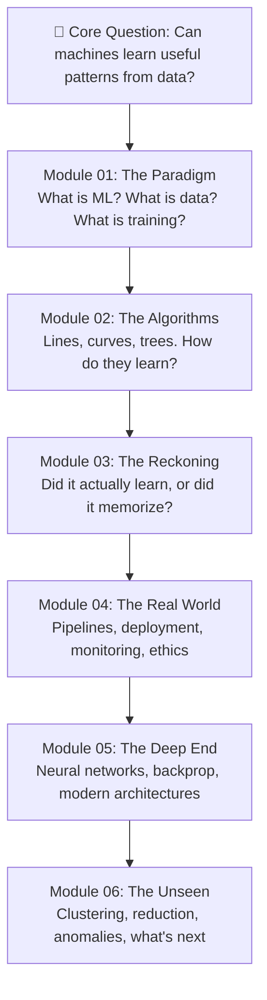

# Machine Learning Course — Senior Researcher Content Blueprint

> [!NOTE]
> This document is the product of research across Stanford CS229, Andrew Ng's Coursera ML & Deep Learning Specializations, fast.ai Practical Deep Learning, Google's Responsible AI curriculum, and multiple authoritative ML education resources. It serves as the definitive content blueprint for expanding the Field Notes "Machine Learning, Visually" course.

---

## Executive Summary

The current course has a strong editorial voice and excellent structural scaffolding (4 modules, 12 lessons). However, the content depth per lesson is thin — typically 2 sections with 2 short paragraphs each. To compete with the best ML education platforms, each lesson needs **5–7 rich sections** with **3–4 substantive paragraphs** per section, plus real-world case studies, visual diagram callouts, and layered exercises.

This report provides:
1. A **philosophy of content flow** — the pedagogical architecture that governs every word
2. A **gap analysis** of what's missing vs. world-class curricula
3. **Detailed content outlines** for all 12 existing lessons (Modules 01–04)
4. **Two proposed new modules** (Module 05: Neural Networks & Deep Learning, Module 06: Unsupervised Learning)
5. A **prioritized implementation roadmap**

---

## Philosophy of Content Flow

> [!IMPORTANT]
> This section defines the **soul** of the course — the pedagogical architecture that every lesson, section, and paragraph must follow. Before writing any content, read this section. It is the constitution.

### The Founding Principle: Intelligence → Data → Mathematics → Systems

Your existing lecture roadmap establishes a profound pedagogical arc that most ML courses get wrong. Instead of starting with algorithms, you start with a question about the nature of intelligence itself:


This arc — from **"What is Intelligence?"** through **Data**, **Mathematics**, **Systems**, **Hypothesis Spaces**, to **Generalisation** — is the philosophical spine of the entire course. Every module we build must trace back to this spine.

---

### The Three Laws of Content Flow

#### Law 1: Human First, Machine Second

Every concept must begin with a human analogy before introducing the machine version. This is drawn directly from your Lecture 1's framework:

| Human | Machine |
|:---|:---|
| Experience | Data |
| Memory | Storage |
| Learning | Training |
| Decision | Prediction |

**In practice:** Before explaining gradient descent, explain how a blindfolded person finds the bottom of a valley. Before explaining K-Means clustering, explain how a child sorts toys into piles without instructions. Before explaining backpropagation, explain how a student corrects their mistakes on a test by tracing back through their reasoning.

The human analogy is not a cute introduction to be discarded — it IS the concept. The algorithm is just the mathematical formalization of an intuition the reader already owns.

#### Law 2: Question → Intuition → Mechanism → Limitation → Consequence

Every section within a lesson must follow this five-beat rhythm:

```
1. QUESTION    — Why does this matter? What problem are we solving?
2. INTUITION   — The visual/physical analogy. No math. No jargon.
3. MECHANISM   — How it actually works. The "what happens under the hood."
4. LIMITATION  — Where it breaks. When it fails. Why it's not universal.
5. CONSEQUENCE — So what? What does this mean for the system you're building?
```

**Example — teaching "Loss Function":**

| Beat | Content |
|:---|:---|
| **Question** | "We've made a prediction. It's wrong. How do we measure *how* wrong?" |
| **Intuition** | "Imagine a topographical map. Mountains are high error, valleys are low error. You're blindfolded. You need to find the valley." |
| **Mechanism** | "The loss function takes every prediction, compares it to the true answer, and outputs a single number. Lower = better. MSE squares the errors so large mistakes hurt more." |
| **Limitation** | "But the landscape has many valleys (local minima), not just one. Your blindfolded hiker might find a small dip and think they've reached the bottom." |
| **Consequence** | "This is why your choice of loss function and optimizer shapes everything the model learns. Optimize for the wrong thing, and the model will dutifully find the wrong valley." |

This rhythm prevents the two most common failures in ML education: (a) explaining *what* without explaining *why*, and (b) presenting algorithms as universally correct rather than as useful-but-flawed tools.

#### Law 3: Data Is Not a Topic — It Is THE Topic

Your Lecture 2 ("Data: The Fuel of Machine Learning") establishes a principle that most ML courses violate: **data is not a prerequisite chapter to rush through before the "real" content (algorithms). Data IS the real content.**

Your framework — `Data → Information → Knowledge` — must echo through every module:

- **Module 01** asks: *What is data? How do we represent reality as numbers?*
- **Module 02** asks: *What patterns can algorithms find in that data?*
- **Module 03** asks: *How do we know those patterns are real and not noise?*
- **Module 04** asks: *How do we keep data flowing reliably in production?*
- **Module 05** asks: *What happens when data is too complex for simple patterns?*
- **Module 06** asks: *What can data tell us when we have no labels at all?*

Every module is ultimately a different lens on the same question: **"How do we extract reliable knowledge from uncertain data?"**

---

### The Content Architecture: Concentric Circles

The course is not a linear sequence of topics. It is a set of **concentric circles** — each module revisits the same core ideas (data, error, generalisation, decisions) at a deeper level of sophistication.



Notice: **Overfitting** appears in Lesson 03 (as a warning), Lesson 06 (in the context of trees), Lesson 07 (as the central problem), and Lesson 14 (vanishing gradients). This is intentional. The student encounters the same demon in increasingly sophisticated forms — each time with better tools to fight it.

---

### The Voice: Instructor as Field Guide

Your lecture materials reveal a clear pedagogical identity: the instructor is not a professor at a lectern — they are a **field guide** walking alongside the student through unfamiliar terrain.

**Voice characteristics drawn from your materials:**

| Quality | Example from your lectures | How to apply in written content |
|:---|:---|:---|
| **Provocative questions** | *"Can machines truly UNDERSTAND, or are they just very good at PATTERN MATCHING?"* | Open every lesson with a question that has no clean answer. Force the reader to think before they read. |
| **Visual metaphors** | Human Learning vs. Machine Learning comparison table | Every abstract concept gets a physical metaphor. Not optional. |
| **Progressive revelation** | Lecture 1 ends with ML types → Lecture 2 picks up with "If machines learn from data, what exactly is data?" | Each lesson's last section must plant a seed for the next lesson's opening question. |
| **Confrontation with limits** | *"Too Many Rules, Too Many Exceptions, Too Many Possibilities"* | Always show where a technique breaks before moving to the next one. The failure of the current tool motivates the introduction of the next. |

**The voice rules:**
- Use "you" and "we", never "one" or "the student"
- Write in present tense — the reader is doing this *now*
- Short, declarative sentences for key insights. Long, flowing sentences for analogies.
- End sections with a single, bold statement that the reader could tweet. *"A model's worldview is entirely constrained by its sampling quality."*

---

### The Lesson Template: Anatomy of a Perfect Lesson

Every lesson on the website must follow this structural template:

```
┌─────────────────────────────────────────────┐
│  EYEBROW    LESSON 07 / GENERALISATION      │
│  TITLE      Overfitting and generalisation   │
│  SUMMARY    Why memorising the past is       │
│             different from learning a        │
│             reusable pattern.                │
│  DURATION   55 min                           │
│  CONCEPT    One-sentence thesis of the       │
│             entire lesson (the "tweet")      │
├─────────────────────────────────────────────┤
│  DIAGRAM    Interactive visual concept       │
│             (regression, classification,     │
│             tree, pipeline, network, etc.)   │
├─────────────────────────────────────────────┤
│  SECTION 1  The opening question             │
│             (Question → Intuition)           │
│  SECTION 2  The core mechanism               │
│             (Mechanism)                      │
│  SECTION 3  The depth                        │
│             (Deeper mechanism or theory)     │
│  SECTION 4  The failure mode                 │
│             (Limitation)                     │
│  SECTION 5  The real-world story             │
│             (Case study / consequence)       │
│  SECTION 6  The practical playbook           │
│             (What to actually do)            │
├─────────────────────────────────────────────┤
│  KEY IDEAS  4–5 tweetable takeaways          │
├─────────────────────────────────────────────┤
│  EXERCISE   Multi-tier:                      │
│             Conceptual → Applied → Critical  │
├─────────────────────────────────────────────┤
│  BRIDGE     "In the next lesson, we ask..."  │
│             (Seeds the next lesson)          │
└─────────────────────────────────────────────┘
```

---

### Alignment: Your Roadmap ↔ Our Course Modules

Your lecture roadmap (Lectures 1–6) maps onto the expanded course as follows:

| Your Lecture | Topic | Our Module | Our Lessons |
|:---|:---|:---|:---|
| Lecture 1 | What is Intelligence? AI vs ML vs DL, Why ML Exists | Module 01 | Lesson 01: What is machine learning? |
| Lecture 2 | Data, Features, Labels, Types of Data | Module 01 | Lesson 02: Features, labels, and datasets |
| Lecture 3 | Mathematics Behind Pattern Discovery | Module 01 + 02 | Lesson 03: Training a first model + Lesson 04: Linear regression |
| Lecture 4 | Components of ML System | Module 04 | Lesson 10: Feature engineering and pipelines + Lesson 11: Deployment and monitoring |
| Lecture 5 | Hypothesis, Hypothesis Space, Learning | Module 02 | Lesson 05: Classification + Lesson 06: Decision trees |
| Lecture 6 | Generalization, Overfitting, Underfitting | Module 03 | Lesson 07: Overfitting and generalisation |

> [!NOTE]
> Your roadmap's Lectures 3 and 5 (Mathematics and Hypothesis Spaces) are woven *throughout* Modules 01–03 rather than isolated in a single lesson. This is intentional — mathematics and theory are presented in context, not as a standalone slog.

---

### The Content Quality Bar: The "Explain It to a Farmer" Test

Inspired by the Feynman Technique and your own teaching style, every section must pass this test:

> **Could a smart person with zero ML background read this section and explain the concept to someone else over coffee?**

If the answer is no, the section is too abstract, too jargon-heavy, or too shallow. Rewrite it with:
1. A physical analogy they can see in their mind
2. A concrete example from daily life
3. A clear statement of why this matters for the system they're building

---

### The Emotional Arc of the Course

Great courses are not just information — they are *journeys* with an emotional arc. The student should feel:

| Module | Emotional State | The Student Thinks... |
|:---|:---|:---|
| **01: Learning from Examples** | 🤔 *Curiosity + Clarity* | "Oh! ML is just finding patterns in data. I can understand this." |
| **02: Supervised Learning** | 💪 *Confidence + Power* | "I can actually build something. Lines, trees, probabilities — these are tools I can use." |
| **03: Generalisation & Evaluation** | 😰 *Humility + Caution* | "Wait — my model might be lying to me? I need to be much more careful." |
| **04: Building Useful Systems** | 🏗️ *Realism + Responsibility* | "The model is just one piece. The system around it determines everything." |
| **05: Neural Networks** | 🚀 *Awe + Depth* | "So THAT's how deep learning works. It's elegant but fragile." |
| **06: Unsupervised & Beyond** | 🗺️ *Horizon + Direction* | "I know what I know, I know what I don't, and I know where to go next." |

This arc — from wonder through power through humility to mastery — is the narrative engine that keeps students engaged across 18 lessons.

---

## Gap Analysis: Current State vs. World-Class Curricula

| Area | Current State | Stanford CS229 / Ng Coursera / fast.ai Standard |
|:---|:---|:---|
| **Sections per lesson** | 2–3 sections | 5–7 sections with progressive depth |
| **Paragraphs per section** | 2 paragraphs | 3–4 paragraphs with examples and analogies |
| **Real-world case studies** | None | 1–2 per lesson (e.g., spam detection, self-driving cars, credit scoring) |
| **Mathematical intuition** | Light | Visual intuition for every formula (no raw LaTeX, but "what it means") |
| **Bias-Variance Tradeoff** | Mentioned in passing | Dedicated lesson with visual decomposition |
| **Regularization** | Not covered | Dedicated treatment (L1/L2, dropout, early stopping) |
| **Cross-Validation** | Not covered | K-Fold, stratified splits, time-series splits |
| **Neural Networks** | Not covered | Entire module (neurons, layers, backprop, activation functions) |
| **Unsupervised Learning** | Not covered | Entire module (clustering, dimensionality reduction, anomaly detection) |
| **Feature Engineering depth** | 1 shallow lesson | Deep treatment: encoding, scaling, interaction terms, temporal features |
| **Responsible AI depth** | 1 shallow lesson | Fairness metrics, model cards, feedback loops, regulatory landscape |
| **Exercises** | 1 per lesson (prompt + hint) | Multi-tier: conceptual → applied → critical thinking |

---

## Module 01: Learning from Examples

> **Status:** Modules 01 and 02 have already been expanded. The outlines below represent the *target depth* that should be maintained and further refined.

### Lesson 01: What is machine learning? (Target: 45 min)

| Section | Content Outline | Depth Target |
|:---|:---|:---|
| **Programs without explicit rules** | Traditional rule-based programming vs. learning from examples. Use the "cat recognition" combinatorial explosion example. Explain that the output is still a deployable program. | 3 paragraphs |
| **Function approximation** | ML = high-dimensional curve-fitting. Straight line (y=mx+c) vs. deep neural network flexibility. "Learning" = searching parameter space. | 3 paragraphs |
| **Inputs, outputs, and a useful objective** | Translating business goals into prediction problems. The "literal genie" danger — models ruthlessly optimize the objective you set (social media feed example). | 3 paragraphs |
| **⚡ NEW: The three families of ML** | Supervised (labeled examples), Unsupervised (structure discovery), Reinforcement (reward signals). Brief overview with one real-world example each. | 3 paragraphs |
| **⚡ NEW: When NOT to use ML** | Simple rules, small datasets, when you need full explainability, when the cost of errors is too high and data is too sparse. ML adds complexity — justify it. | 2 paragraphs |

**Key Ideas (5):**
- Traditional software uses rules to process data; ML uses data to discover rules.
- ML is fundamentally high-dimensional function approximation driven by search.
- The objective determines the behaviour you reward, and models are literal optimizers.
- ML comes in three families: supervised, unsupervised, and reinforcement learning.
- ML is not always the right answer — complexity must be justified.

**Exercise (multi-tier):**
1. *Conceptual:* Turn one vague business goal into a specific prediction problem.
2. *Applied:* For your prediction problem, identify whether it's supervised, unsupervised, or reinforcement learning — and why.
3. *Critical:* Describe a scenario where using ML would be inappropriate and a simple rule would be better.

---

### Lesson 02: Features, labels, and datasets (Target: 50 min)

| Section | Content Outline | Depth Target |
|:---|:---|:---|
| **The shape of an example** | Features = columns, labels = target. Feature selection as product design. "Describe a house to an alien using 5 numbers" analogy. | 2 paragraphs |
| **The semantic gap** | The gap between human concepts (creditworthiness) and digital proxies (late payments). Goodhart's Law. | 3 paragraphs |
| **Sampling creates the world** | Models assume training data = reality. Amazon resume screening bias example. Ask: who is missing? | 3 paragraphs |
| **⚡ NEW: Data types and their challenges** | Tabular vs. text vs. images vs. time-series. Each has different preprocessing, different failure modes. Missing data strategies (imputation, deletion, indicators). | 3 paragraphs |
| **⚡ NEW: Label noise and the "ground truth" illusion** | Labels are created by humans (annotators, business rules, heuristics). Inter-annotator disagreement. Labels can be systematically wrong. Medical imaging labeling controversy. | 3 paragraphs |
| **⚡ NEW: Case study — ImageNet's hidden biases** | How ImageNet's labeling revealed cultural biases, geographic representation gaps. What this taught the field about dataset design. | 2 paragraphs |

**Key Ideas (5):**
- Features encode human assumptions about what matters.
- Models optimize for measurable proxies, which often fail to capture human intent (The Semantic Gap).
- Labels are not "ground truth" — they contain human judgement, error, and historical noise.
- Different data modalities (tabular, text, image, time-series) require fundamentally different treatment.
- A model's worldview is entirely constrained by its sampling quality.

---

### Lesson 03: Training a first model (Target: 55 min)

| Section | Content Outline | Depth Target |
|:---|:---|:---|
| **Start with a baseline** | Heuristic baselines. 82% neural net vs. 80% SQL query — is the complexity justified? | 3 paragraphs |
| **The loss landscape** | Loss function as a topographical map. Parameters = coordinates, elevation = error. Global vs. local minima. | 2 paragraphs |
| **Fit, measure, adjust** | Gradient descent as a blindfolded hiker. SGD and mini-batches. The iterative training loop. | 3 paragraphs |
| **⚡ NEW: Learning rate — the most important hyperparameter** | Step size analogy. Too large = overshooting. Too small = painfully slow. Learning rate schedules (warmup, decay). Visual intuition of oscillation vs. convergence. | 3 paragraphs |
| **⚡ NEW: Epochs, batches, and convergence** | What is an epoch? What is a mini-batch? How do you know when to stop training? The training loss curve. Early stopping as a regularization technique. | 3 paragraphs |
| **⚡ NEW: Case study — Netflix Prize** | How a $1M competition proved that sometimes a 10% improvement in loss translates to a barely noticeable user experience gain. The lesson: loss is a proxy, not the goal. | 2 paragraphs |

**Key Ideas (5):**
- Complex models must justify their existence by beating a simple, no-ML baseline.
- The loss function translates abstract mistakes into an optimizable penalty score.
- Training is a mathematical search for the lowest error in a parameter landscape.
- The learning rate is the single most impactful hyperparameter — too large or too small and training fails.
- Zero training error usually indicates memorization (overfitting), not true learning.

---

## Module 02: Supervised Learning

### Lesson 04: Linear regression (Target: 55 min)

| Section | Content Outline | Depth Target |
|:---|:---|:---|
| **A line as a model** | Intercept + slopes. Coefficient interpretation. Why linear models are industry workhorses. | 3 paragraphs |
| **Residuals reveal the miss** | Residual = actual – predicted. Random residuals = good. U-curves/funnels = model failure. | 3 paragraphs |
| **The limits of lines** | Non-linear reality (fertilizer saturation). Feature engineering as a workaround (polynomial features). | 2 paragraphs |
| **⚡ NEW: Multiple regression and multicollinearity** | When you have 50 features, not just 1. The danger of correlated features (multicollinearity) — coefficients become unstable and uninterpretable. VIF as a diagnostic. | 3 paragraphs |
| **⚡ NEW: Regularization — L1 and L2** | Ridge (L2) shrinks coefficients toward zero. Lasso (L1) forces some to exactly zero (automatic feature selection). The "penalty budget" analogy. Elastic Net as a compromise. | 3 paragraphs |
| **⚡ NEW: Case study — Zillow's $500M mistake** | How Zillow's automated home-buying algorithm (iBuying) failed because the linear assumptions about housing prices broke during COVID market volatility. | 2 paragraphs |

---

### Lesson 05: Classification and logistic regression (Target: 60 min)

| Section | Content Outline | Depth Target |
|:---|:---|:---|
| **Probability before category** | Regression predicts numbers, classification predicts categories. Why outputting probabilities first preserves nuance. | 2 paragraphs |
| **The logistic curve** | Why you can't use a straight line for probabilities (outputs must be 0–1). The Sigmoid S-curve. | 2 paragraphs |
| **Thresholds and tradeoffs** | Precision vs. Recall seesaw. The threshold as a product/business decision, not a math one. | 3 paragraphs |
| **⚡ NEW: The confusion matrix** | True Positives, False Positives, True Negatives, False Negatives. How to read it. Why "accuracy" alone is dangerously misleading for imbalanced datasets (99% "not fraud" → 99% accuracy by doing nothing). | 3 paragraphs |
| **⚡ NEW: ROC curves and AUC** | The ROC curve as a visual summary of all possible threshold choices. AUC as a single number that summarizes classifier quality across all thresholds. What a perfect, random, and terrible classifier look like on the curve. | 3 paragraphs |
| **⚡ NEW: Calibration — when 80% should mean 80%** | A model says "80% chance of rain". Does it actually rain 80% of the time when it says that? Calibration plots. Why uncalibrated models are dangerous in high-stakes decisions (medical, legal). | 2 paragraphs |

---

### Lesson 06: Decision trees and forests (Target: 65 min)

| Section | Content Outline | Depth Target |
|:---|:---|:---|
| **Learning useful questions** | The "20 Questions" game analogy. Gini impurity and information gain (intuition, not math). | 3 paragraphs |
| **The overfitting trap** | Unlimited depth = memorization. Pruning and max depth constraints. | 2 paragraphs |
| **Strength in disagreement** | Random Forests as voting ensembles. Bagging and feature randomness. The "wisdom of crowds". | 3 paragraphs |
| **⚡ NEW: Gradient Boosting — learning from mistakes** | XGBoost/LightGBM. Instead of averaging independent trees, each new tree focuses on correcting the errors of the previous one. "Boosting" as iterative error correction. Why gradient boosted trees dominate Kaggle competitions and industry tabular ML. | 3 paragraphs |
| **⚡ NEW: Feature importance** | Which features did the tree find most useful? Permutation importance vs. impurity-based importance. How to use importance for model debugging and feature selection. | 2 paragraphs |
| **⚡ NEW: Case study — credit scoring** | How financial institutions use tree ensembles for credit decisions. The tension between model performance and regulatory explainability (ECOA, FCRA). Why "the model said no" is not an acceptable answer. | 2 paragraphs |

---

## Module 03: Generalisation and Evaluation

### Lesson 07: Overfitting and generalisation (Target: 55 min)

| Section | Content Outline | Depth Target |
|:---|:---|:---|
| **The central problem** | Memorizing noise vs. learning signal. The flexibility/capacity tradeoff. | 2 paragraphs |
| **Regularisation and restraint** | L1/L2 penalties, dropout (for neural nets), early stopping. The "Occam's Razor" of ML. | 2 paragraphs |
| **⚡ NEW: The Bias-Variance Tradeoff** | The most important conceptual framework in ML. Total Error = Bias² + Variance + Irreducible Noise. High bias = underfitting (too simple). High variance = overfitting (too sensitive). The "sweet spot" in model complexity. Visual: the U-shaped test error curve. | 4 paragraphs |
| **⚡ NEW: The double descent phenomenon** | Modern deep learning challenges the classical bias-variance curve. Very large models can "overfit" and then come back to generalize well again. An active area of research. | 2 paragraphs |
| **⚡ NEW: Practical strategies** | How to diagnose: learning curves (training error vs. validation error over epochs). High bias → add complexity, more features. High variance → more data, regularization, simplify model. A decision flowchart. | 3 paragraphs |

---

### Lesson 08: Splitting data correctly (Target: 50 min)

| Section | Content Outline | Depth Target |
|:---|:---|:---|
| **Three different jobs** | Train → fit parameters. Validation → guide choices. Test → final estimate. Never reuse test data. | 2 paragraphs |
| **Time, groups, and leakage** | Why random splits fail for time-series, grouped data. Leakage = using future info during training. | 2 paragraphs |
| **⚡ NEW: K-Fold Cross-Validation** | The "practice test" analogy. How K-Fold works step-by-step. Stratified K-Fold for imbalanced data. Leave-One-Out Cross-Validation (LOOCV) and when it's appropriate. | 3 paragraphs |
| **⚡ NEW: Time-series splits** | Walk-forward validation. Expanding window vs. sliding window. Why you must never shuffle time-series data. Financial backtesting as an example. | 3 paragraphs |
| **⚡ NEW: Data leakage — the silent performance killer** | The most common and most devastating mistake in applied ML. Leakage from the future (using outcome data as a feature). Leakage from preprocessing (fitting scalers on the whole dataset instead of train only). Leakage from related examples (multiple photos of the same patient in train and test). A checklist for detecting leakage. | 3 paragraphs |

---

### Lesson 09: Metrics and thresholds (Target: 60 min)

| Section | Content Outline | Depth Target |
|:---|:---|:---|
| **Accuracy can hide failure** | 99% accuracy on 1% fraud rate = useless model. Imbalanced classes expose accuracy's lie. | 2 paragraphs |
| **From metric to policy** | Threshold as an operational lever. How humans and downstream systems respond. | 2 paragraphs |
| **⚡ NEW: The full metrics zoo** | Precision, Recall, F1-Score, Specificity, False Positive Rate. When to use each. A decision table: "If your priority is X, use metric Y." | 3 paragraphs |
| **⚡ NEW: Regression metrics** | MAE vs. MSE vs. RMSE vs. MAPE. When each is appropriate. MAE is robust to outliers, MSE heavily penalizes large errors. R² and its limitations. | 3 paragraphs |
| **⚡ NEW: Business metrics vs. model metrics** | A model with 5% better F1 might generate $0 more revenue. Connecting model performance to business KPIs. Revenue per prediction, cost per false positive, net incremental lift. | 3 paragraphs |
| **⚡ NEW: A/B testing ML models** | How to validate that a "better" model actually improves user outcomes. Online vs. offline evaluation. The gap between offline metrics and real-world impact. | 2 paragraphs |

---

## Module 04: Building Useful Systems

### Lesson 10: Feature engineering and pipelines (Target: 60 min)

| Section | Content Outline | Depth Target |
|:---|:---|:---|
| **Representation is leverage** | Good features > complex algorithms. Domain knowledge as the secret weapon. | 2 paragraphs |
| **Prevent training-serving skew** | Same transformations in training and production. Reusable pipelines. | 2 paragraphs |
| **⚡ NEW: Encoding categorical variables** | One-Hot Encoding (nominal), Ordinal Encoding (ordered), Target Encoding (high-cardinality). When each is appropriate. The danger of high cardinality with one-hot. | 3 paragraphs |
| **⚡ NEW: Feature scaling** | StandardScaler (mean=0, std=1), MinMaxScaler (0–1), RobustScaler (outlier-resistant). Which algorithms need scaling (KNN, SVM, Neural Nets) and which don't (tree-based models). | 3 paragraphs |
| **⚡ NEW: Temporal and interaction features** | Extracting `day_of_week`, `hour`, `is_weekend` from timestamps. Creating interaction features (price × quantity = revenue). Lag features for time-series. Rolling averages and exponential smoothing. | 3 paragraphs |
| **⚡ NEW: Case study — Uber's Michelangelo** | How Uber built a centralized feature engineering platform to ensure consistency between training and serving across thousands of models. The scale of real-world feature management. | 2 paragraphs |

---

### Lesson 11: Deployment and monitoring (Target: 65 min)

| Section | Content Outline | Depth Target |
|:---|:---|:---|
| **Serving a prediction** | Batch vs. online serving. Latency, cost, freshness tradeoffs. Versioning and fallback. | 2 paragraphs |
| **Watch the world change** | Data drift vs. concept drift. Monitor distributions, delayed outcomes, business impact. | 2 paragraphs |
| **⚡ NEW: The ML lifecycle** | Experimentation → Validation → Deployment → Monitoring → Retraining → Retirement. ML systems are living, breathing feedback loops, not static files. The "technical debt" of ML systems (Google's seminal paper). | 3 paragraphs |
| **⚡ NEW: Shadow deployments and canary releases** | How to test a new model against live traffic without affecting users. Shadow mode: run new model in parallel, compare outputs. Canary: route 1% of traffic to new model, gradually increase. | 3 paragraphs |
| **⚡ NEW: Drift detection in practice** | Statistical methods: KS-test, PSI, Jensen-Shannon divergence. How to set alert thresholds. What to do when drift is detected (investigate → analyze → retrain → fallback). Tools: Evidently AI, NannyML, Arize. | 3 paragraphs |
| **⚡ NEW: Case study — Knight Capital's $440M loss** | While not ML-specific, this algorithmic trading failure illustrates what happens when automated systems lack monitoring, rollback, and human oversight. The universal lesson for any deployed algorithm. | 2 paragraphs |

---

### Lesson 12: Responsible ML project (Target: 90 min — Capstone)

| Section | Content Outline | Depth Target |
|:---|:---|:---|
| **Build the smallest credible system** | Start with the decision, a baseline, and an evaluation plan. Document assumptions. | 2 paragraphs |
| **Communicate the whole system** | Model cards. Stakeholder communication. Making limitations visible. | 2 paragraphs |
| **⚡ NEW: Sources of bias in ML** | Historical bias (data reflects past discrimination), Representation bias (some groups underrepresented), Measurement bias (features are proxied differently for different groups), Aggregation bias (one model for diverse subgroups). Real examples: COMPAS recidivism, facial recognition accuracy gaps. | 3 paragraphs |
| **⚡ NEW: Fairness metrics and their tensions** | Demographic parity, equalized odds, predictive parity. The impossibility theorem: you mathematically cannot satisfy all fairness definitions simultaneously. Choosing which fairness definition is appropriate for your context. | 3 paragraphs |
| **⚡ NEW: The EU AI Act and regulatory landscape** | High-risk AI systems. Transparency requirements. Right to explanation. How regulation is shaping what practitioners must document and disclose. | 2 paragraphs |
| **⚡ NEW: Model cards and datasheets** | Google's Model Card template. Datasheets for Datasets (Gebru et al.). What must be documented: intended use, training data, evaluation results, ethical considerations, limitations, and monitoring plan. | 3 paragraphs |
| **⚡ NEW: Feedback loops and unintended consequences** | Predictive policing: model predicts crime in area → more police sent → more arrests → model sees "more crime" → reinforces prediction. How ML systems can create self-fulfilling prophecies. | 2 paragraphs |

---

## Module 05 — Unsupervised Learning ✅ CONFIRMED

> [!NOTE]
> **Scope decision:** Strictly ML, not DL. This module covers classical unsupervised ML algorithms only. Deep Learning (CNNs, RNNs, Transformers, Autoencoders) is **out of scope** for this course and will be a separate future course.

### Lesson 13: Clustering — finding structure without labels (55 min)

| Section | Content Outline | Depth Target |
|:---|:---|:---|
| **Learning without a teacher** | Supervised = labeled answers. Unsupervised = find hidden structure. The "party of strangers" analogy — you observe who talks to whom, how they dress, and naturally form groups without anyone telling you. | 3 paragraphs |
| **K-Means clustering** | Choose K → randomly place centroids → assign points to nearest → move centroids to mean → repeat. Simple, fast, but assumes spherical clusters and requires choosing K upfront. Step-by-step visual walkthrough. | 3 paragraphs |
| **Choosing K — the elbow method and silhouette scores** | How to pick the right number of clusters. The elbow plot (diminishing returns in within-cluster variance). Silhouette score (how well-separated are the clusters?). Why there's no single "correct" K — it depends on your use case. | 3 paragraphs |
| **Beyond K-Means — DBSCAN and hierarchical clustering** | DBSCAN finds arbitrarily shaped clusters and identifies outliers automatically. Hierarchical clustering creates a tree (dendrogram) of cluster relationships. When each is appropriate. Visual comparison of cluster shapes. | 3 paragraphs |
| **The evaluation problem** | In supervised learning, you check predictions against labels. In unsupervised learning, there are no labels. How do you know if your clusters are "good"? Internal metrics (silhouette, Davies-Bouldin) vs. external validation vs. domain expert judgment. | 2 paragraphs |
| **Case study — customer segmentation** | How retail companies use clustering to segment customers into behavioral groups (high-value, at-risk, bargain-hunters) and tailor marketing strategies accordingly. | 2 paragraphs |

**Diagram type:** `"cluster"` — visual showing K-Means iterations (centroid movement), plus comparison of K-Means vs. DBSCAN on non-spherical data.

**Key Ideas (5):**
- Unsupervised learning discovers hidden structure when you have no labels to guide you.
- K-Means is simple and fast but assumes spherical, evenly-sized clusters.
- Choosing K is a modeling decision, not a math problem — the "right" answer depends on context.
- DBSCAN handles arbitrary shapes and naturally identifies outliers.
- Evaluating unsupervised results requires a mix of statistical metrics and domain expertise.

**Exercise (multi-tier):**
1. *Conceptual:* You're given a scatter plot of customers. Sketch where K-Means would place centroids for K=3.
2. *Applied:* A marketing team asks "How many customer segments do we have?" Explain why this question has no single correct answer.
3. *Critical:* A company clusters users and discovers one segment is predominantly a single ethnicity. What should they do? What are the risks of acting on this?

---

### Lesson 14: Dimensionality reduction — simplifying complexity (55 min)

| Section | Content Outline | Depth Target |
|:---|:---|:---|
| **The curse of dimensionality** | As dimensions increase, data becomes exponentially sparse. Distance metrics lose meaning. Models need exponentially more data. Imagine a unit cube: in 1D, 10 points cover it well. In 100D, you'd need 10^100 points. | 3 paragraphs |
| **PCA — Principal Component Analysis** | The "coffee mug photo" analogy. You have a 3D object and want a 2D photo — you rotate it to the angle that shows the most detail. PCA does this mathematically: it finds new axes (Principal Components) that capture the most variance. Scree plots and explained variance ratios. | 3 paragraphs |
| **How PCA works — variance as information** | Variance = information. A feature where every value is identical tells you nothing. PCA ranks directions by how much variance they explain. The first PC captures the most, the second captures the most of what's left (orthogonally), and so on. When 95% of variance is in 3 components out of 100, you can safely drop the other 97. | 3 paragraphs |
| **t-SNE and UMAP — visualization tools** | Non-linear dimensionality reduction for visualization. How to project 100-dimensional data into 2D for human inspection. These are for *exploration and storytelling*, not for feeding into models. Limitations: results change with hyperparameters, distances between clusters are not meaningful. | 2 paragraphs |
| **When to reduce dimensions** | Use PCA when you have too many correlated features and need to speed up training or remove noise. Use t-SNE/UMAP when you need to *see* your data. Don't use dimensionality reduction just because you can — sometimes the original features are more interpretable. | 2 paragraphs |
| **Case study — anomaly detection in credit card fraud** | How fraud detection systems use PCA to learn the "normal" pattern of transactions. When a new transaction doesn't fit the compressed representation, it's flagged. Reconstruction error as a distance from normalcy. | 2 paragraphs |

**Diagram type:** `"reduction"` — visual showing 3D data being projected to 2D via PCA (rotation to max-variance axis), plus a t-SNE scatter plot of clustered data.

**Key Ideas (5):**
- High-dimensional data is exponentially harder to work with (the curse of dimensionality).
- PCA finds the axes of maximum variance — the directions where your data is most "spread out".
- Dimensionality reduction can speed up training, remove noise, and enable visualization.
- t-SNE and UMAP are for exploration and storytelling, not for production model input.
- Reconstruction error after compression can reveal anomalies — things that don't fit the learned pattern.

**Exercise (multi-tier):**
1. *Conceptual:* You have a dataset with 200 features. After running PCA, the first 5 components explain 92% of the variance. What would you do and why?
2. *Applied:* A colleague says "PCA told me that feature #47 is the most important." Explain why this statement misunderstands what PCA does.
3. *Critical:* A bank uses PCA-based anomaly detection to flag fraud. It flags transactions from a country where very few training examples existed. Is this a model success or a bias failure?

---

## Module 06 — The ML Landscape: What Comes Next ✅ CONFIRMED

> [!NOTE]
> This module is the course epilogue. It gives students a map of what they've learned, what they haven't, and where to go next — all within the ML (not DL) boundary, with DL positioned as a natural next course.

### Lesson 15: The complete ML toolkit — choosing the right algorithm (50 min)

| Section | Content Outline | Depth Target |
|:---|:---|:---|
| **The algorithm selection flowchart** | A decision tree for choosing algorithms: How much data? Labeled or unlabeled? Regression or classification? Need interpretability? → This maps to the right family of algorithms. Visual flowchart diagram. | 3 paragraphs |
| **Comparing what you've learned** | Side-by-side comparison of all algorithms covered: Linear Regression, Logistic Regression, Decision Trees, Random Forests, Gradient Boosting, K-Means, PCA. Strengths, weaknesses, data requirements, interpretability. Large comparison table. | 3 paragraphs |
| **The no-free-lunch theorem** | No single algorithm is best for all problems. The algorithm that wins depends entirely on the structure of your specific data. This is why understanding multiple approaches matters. | 2 paragraphs |
| **Ensemble thinking beyond Random Forests** | Stacking, blending, and voting. How Kaggle winners combine multiple model families. The principle: diversity of errors is more valuable than individual accuracy. | 2 paragraphs |
| **When ML meets the real world** | The gap between Kaggle competitions and production systems. Data quality, latency constraints, interpretability requirements, regulatory compliance. A checklist for deciding if your model is ready for deployment. | 3 paragraphs |

**Diagram type:** `"flowchart"` — an interactive algorithm selection decision tree.

**Key Ideas (5):**
- There is no universal best algorithm — the right choice depends on your data, constraints, and goals.
- Interpretability, speed, and accuracy form a triangle of tradeoffs.
- Ensemble methods work because diverse errors cancel out.
- The gap between a working notebook and a production system is enormous.
- Understanding multiple algorithms gives you the judgment to choose wisely.

**Exercise (multi-tier):**
1. *Conceptual:* Given a dataset with 50 labeled rows and 5 features, which algorithm would you try first and why?
2. *Applied:* Build a comparison table for a real problem: spam detection. Evaluate Linear Regression, Logistic Regression, and Random Forest on interpretability, speed, and expected accuracy.
3. *Critical:* A company says "We use XGBoost for everything." What are the risks of this approach?

---

### Lesson 16: Where to go from here (40 min — Course Epilogue)

| Section | Content Outline | Depth Target |
|:---|:---|:---|
| **What you now know** | A retrospective of the journey: from "What is intelligence?" through data, algorithms, evaluation, deployment, ethics, and unsupervised learning. The student has a complete classical ML foundation. | 2 paragraphs |
| **The deep learning horizon** | A brief, honest preview of what deep learning adds: neural networks, CNNs for images, RNNs for sequences, Transformers for language. Position this as the natural next course, not as something missing from this one. | 3 paragraphs |
| **Reinforcement learning — learning from consequences** | An agent interacts with an environment, takes actions, receives rewards. Game-playing (AlphaGo), robotics, recommendation systems. A conceptual map for further study. | 2 paragraphs |
| **The practitioner's toolkit** | Python, scikit-learn, pandas, matplotlib for classical ML. Jupyter notebooks for experimentation. Git for version control. The ecosystem map for a working ML practitioner. | 2 paragraphs |
| **Your learning path forward** | Three paths based on interest: Research (statistics, theory, papers), Engineering (MLOps, pipelines, deployment), Application (domain-specific ML — healthcare, finance, NLP). Recommended books, courses, and communities for each path. | 3 paragraphs |

**Diagram type:** `"pipeline"` — a visual map of the complete ML landscape showing what was covered (highlighted) and what lies ahead (grayed out: DL, RL, GenAI).

**Key Ideas (4):**
- Classical ML is a complete, powerful toolkit — not a stepping stone to deep learning.
- Deep learning extends ML to unstructured data (images, text, audio) but requires more data and compute.
- The best practitioners know when NOT to use deep learning.
- Your next step depends on your goal: research, engineering, or application.

---

## Implementation Roadmap ✅ ALL 3 PHASES CONFIRMED

> [!IMPORTANT]
> **Decision: Implement all 3 phases.** Scope is strictly classical ML — no deep learning content.

### Phase 1: Deepen Existing Modules (Modules 01–04)

| Task | Effort | Impact |
|:---|:---|:---|
| Expand Module 03 (Lessons 07–09) to target depth | Medium | Very High — Evaluation is the #1 gap |
| Expand Module 04 (Lessons 10–12) to target depth | Medium | High — Deployment/responsibility are differentiators |
| Restructure `Lesson` type: multi-tier exercises + case studies | Medium | High — Foundation for all new content |
| Add case studies to all 12 lessons | Low | High — Immediately makes content feel real |
| Add multi-tier exercises to all lessons | Low | Medium — Improves engagement |
| Add new `DiagramType` values to support visual content | Low | High — Visual richness |

### Phase 2: New Content — Unsupervised Learning (Module 05)

| Task | Effort | Impact |
|:---|:---|:---|
| Create Lesson 13: Clustering (K-Means, DBSCAN, hierarchical) | High | Very High |
| Create Lesson 14: Dimensionality reduction (PCA, t-SNE, UMAP) | High | High |
| Implement `"cluster"` and `"reduction"` diagram components | Medium | High — Visual identity for the new module |

### Phase 3: New Content — ML Landscape Epilogue (Module 06)

| Task | Effort | Impact |
|:---|:---|:---|
| Create Lesson 15: The complete ML toolkit — algorithm selection | High | High — Ties the whole course together |
| Create Lesson 16: Where to go from here (epilogue) | Medium | Medium — Provides closure and direction |
| Implement `"flowchart"` diagram for algorithm selection guide | Medium | High — Signature visual for the course |
| Update course metadata (total lessons: 16, duration: 14–18 hours) | Low | Low |

---

## Technical Notes for Implementation ✅ CONFIRMED

### Data Model Changes — DiagramType

The current `DiagramType` union in [course-data.ts](file:///Users/visheshpanghal/Documents/making/lib/course-data.ts#L1) supports:
```typescript
export type DiagramType = "regression" | "classification" | "gradient" | "tree" | "pipeline";
```

**Updated type (confirmed):**
```typescript
export type DiagramType =
  | "regression"       // Line fitting, residuals
  | "classification"   // Decision boundaries, sigmoid curve
  | "gradient"         // Loss landscape, gradient descent steps
  | "tree"             // Decision tree splits, forest ensemble
  | "pipeline"         // ML lifecycle, data flow
  | "cluster"          // K-Means iterations, DBSCAN shapes
  | "reduction"        // PCA projection, t-SNE scatter
  | "flowchart"        // Algorithm selection guide, decision flows
  | "bias"             // Bias-variance tradeoff curve, learning curves
  | "confusion_matrix" // TP/FP/TN/FN grid, ROC curve
  | "drift";           // Data drift monitoring, distribution shifts
```

### Lesson Type Restructure — Multi-tier Exercises ✅ CONFIRMED

The `exercise` field will be replaced with a structured `exercises` object. The old `exercise` field is deprecated.

```typescript
export type Lesson = {
  slug: string;
  title: string;
  eyebrow: string;
  summary: string;
  duration: string;
  diagram: DiagramType;
  concept: string;
  sections: {
    title: string;
    body: string[];
  }[];
  keyIdeas: string[];

  // ❌ DEPRECATED — will be migrated
  // exercise: { prompt: string; hint: string };

  // ✅ NEW — multi-tier exercise system
  exercises: {
    conceptual: { prompt: string; hint: string };  // "Explain this concept"
    applied: { prompt: string; hint: string };      // "Apply it to a scenario"
    critical: { prompt: string; hint: string };     // "Challenge assumptions"
  };

  // ✅ NEW — inline case study
  casestudy?: {
    title: string;
    body: string[];
  };
};
```

### Course Metadata Update

```typescript
// Current
duration: "8–10 hours"
// Updated after all phases
duration: "14–18 hours"
```

### Emotional Arc Update (ML-only scope)

With the DL module removed, the arc becomes tighter and more focused:

| Module | Emotional State | The Student Thinks... |
|:---|:---|:---|
| **01: Learning from Examples** | 🤔 *Curiosity + Clarity* | "Oh! ML is just finding patterns in data. I can understand this." |
| **02: Supervised Learning** | 💪 *Confidence + Power* | "I can actually build something. Lines, trees, probabilities — these are tools I can use." |
| **03: Generalisation & Evaluation** | 😰 *Humility + Caution* | "Wait — my model might be lying to me? I need to be much more careful." |
| **04: Building Useful Systems** | 🏗️ *Realism + Responsibility* | "The model is just one piece. The system around it determines everything." |
| **05: Unsupervised Learning** | 🔍 *Discovery + Exploration* | "I can find patterns even when nobody tells me what to look for." |
| **06: The ML Landscape** | 🗺️ *Mastery + Direction* | "I have a complete ML toolkit. I know what I know, and I know where to go next." |

---

## Resolved Decisions

> [!TIP]
> All open questions have been resolved. These decisions are final and should guide implementation.

| # | Question | Decision | Rationale |
|:---|:---|:---|:---|
| 1 | **Scope** | ✅ Implement all 3 phases | Full curriculum expansion |
| 2 | **Course boundary** | ✅ Strictly ML, no DL | DL becomes a separate future course. Module 05 is now Unsupervised Learning. |
| 3 | **Exercise structure** | ✅ Restructure type system | New `exercises` field with `conceptual`, `applied`, and `critical` tiers replaces old single `exercise`. |
| 4 | **Visual content** | ✅ Add all new diagram types | New types: `cluster`, `reduction`, `flowchart`, `bias`, `confusion_matrix`, `drift`. Plus flowcharts and visual comparison tables. |

### What was removed (out of scope for this course)

- ~~Module 05: Neural Networks and Deep Learning~~ → Future "Deep Learning, Visually" course
- ~~Lesson: The neuron and the network~~
- ~~Lesson: Backpropagation and training deep networks~~
- ~~Lesson: Modern architectures (CNNs, RNNs, Transformers)~~
- ~~Lesson: Transfer learning~~
- ~~Autoencoders section~~ (removed from dimensionality reduction — it's a DL technique)

### Final course structure

| Module | Lessons | Total |
|:---|:---|:---|
| 01: Learning from Examples | Lessons 01–03 | 3 |
| 02: Supervised Learning | Lessons 04–06 | 3 |
| 03: Generalisation and Evaluation | Lessons 07–09 | 3 |
| 04: Building Useful Systems | Lessons 10–12 | 3 |
| 05: Unsupervised Learning | Lessons 13–14 | 2 |
| 06: The ML Landscape | Lessons 15–16 | 2 |
| **Total** | | **16 lessons** |
